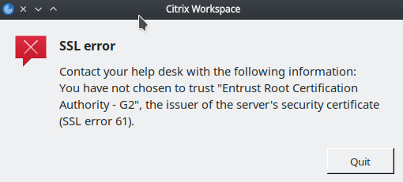

# Connecting to Justice via JusAccess using Linux
_Last Updated: 2021/Feb/8_
## Introduction
The following document details the steps needed to follow to be able to use JusAccess on Linux to connect to the Justice network. JusAccess requires that you use an authentication token device to do the login via JusAccess. The steps within this document detail how to setup the correct software to then allow running the various applications available via JusAccess once you have successfully logged in.
## Installation Procedure
1. Download the Citrix Workspace installation package (the exact package will depend on which flavor of Linux that you have):
https://www.citrix.com/downloads/workspace-app/linux/workspace-app-for-linux-latest.html

2. Install the package. The specifics of this step will vary from Linux versions and platform. It is recommended that you install via the command line terminal to be able to see any warning or errors that might occur.

3. In theory, you should be all set. If you get one of the following errors when trying to start an application via JusAccess, the follow the steps below to fix that error:
 
   
 
   Or

   

   You should be able to fix the above error(s) by running these commands in a terminal window:
   ```bash
   cd /opt/Citrix/ICAClient/keystore/
   sudo rm -rf cacerts
   sudo ln -s /etc/ssl/certs cacerts
   ```

At this point, you should be able to run the applications that are available via JusAccess.

:+1:
